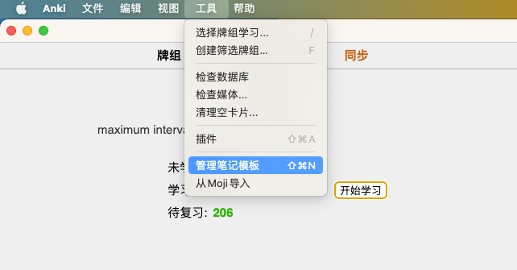
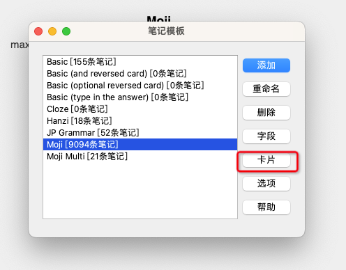
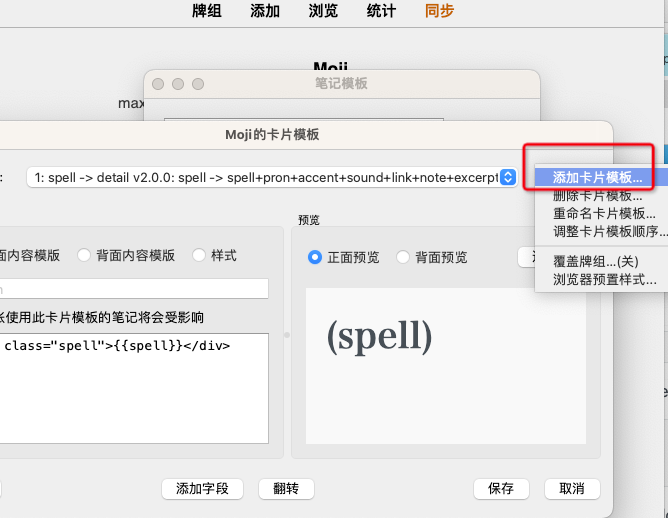

# 创建Question页为翻译的卡片
1.打开菜单[管理笔记模板]


2.在左侧选择对应的笔记模板后，在右侧点击按钮[卡片]


3.在右上角选择[添加卡片模板]或在左侧直接编辑已有的卡片模板


4.在[正面内容模板]中填入以下内容
```
<div class="word-head">
    <div class="word-tool">
        {{part_of_speech}}
    </div>
</div>
<div class="word-detail">
    <div class="paraphrase">{{trans}}{{^trans}}{{excerpt}}{{/trans}}</div>
</div>
```

5.在[背面内容模板]中填入以下内容
```
<script>
    // 初始是否展开所有例句，选填 true 或 false
    initAllActive = true
    
    // 是否显示罗马音，选填 true 或 false
    showRomaji = false
    
    // 是否显示音调符号，选填 true 或 false
    showAccent = true
    
    // 是否显示分级标签，选填 true 或 false
    showTag = true
    
    // 活用型版本A(五段/一段/カ变/サ变)或B(一类/二类/三类)，选填 'A' 或 'B'
    katuyouVersion = 'A'
    
    // 释义/详解(1)、笔记(2)的显示顺序，选填 "12" 或 "21"
    showOrder = "21"
</script>

<div class="word-head">
    <div class="head-spell">
        <span class="spell">{{spell}}</span>
        <span class="accent">{{accent}}</span>
    </div>
    <div class="head-sub">
        <div class="pron">{{pron}}</div>
        <div class="split—line romaji-split hidden"></div>
        <div class="romaji hidden"></div>
        <div class="entry-voice-container word-voice">
            {{sound}}
        </div>
    </div>
    <div class="word-tool">
        {{part_of_speech}}
        {{#part_of_speech}}
        <div class="split—line"></div>
        {{/part_of_speech}}
        <div class="word-tag hidden"></div>
        <div class="split—line tag-split hidden"></div>
        <div class="el-tooltip icon-wrap item">
            <a class="to-moji" href="{{MojiToAnki_link:link}}">
                <i class="iconfont iconic-common-share"></i>
            </a>
        </div>
        <div class="el-tooltip icon-wrap item">
            <a class="update-word" onclick="pycmd('MojiToAnki_update')" href="#">
                <i class="iconfont"></i>
            </a>
        </div>
    </div>
</div>

<div class="word-detail">
    <div class="note">
    {{#note}}
        <div class="note-header">
            <span class="title">笔记</span>
        </div>
        <div class="note-body">
            <div class="note-content">{{note}}</div>
        </div>
    {{/note}}
    </div>

    {{examples}}
    
    {{^examples}}
    <div class="paraphrase">{{trans}}{{^trans}}{{excerpt}}{{/trans}}</div>
    {{/examples}}
</div>

<script>
    replayButton = document.querySelector('.replay-button');
    if (replayButton) {
        replayButton.innerHTML='<i class="iconfont iconic-common-voice"></i>';
    }

    subdetailHeaders = document.getElementsByClassName('subdetail_header')
    for (let subdetailHeader of subdetailHeaders) {
        subdetailHeader.isActive = () =>  subdetailHeader.nextElementSibling.classList.contains('active')
        subdetailHeader.setActive = newValue => {
            if(newValue) {
                subdetailHeader.nextElementSibling.classList.add('active')
                subdetailHeader.getElementsByClassName('subdetail_icon')[0].classList.add('is-active')
            } else {
                subdetailHeader.nextElementSibling.classList.remove('active')
                subdetailHeader.getElementsByClassName('subdetail_icon')[0].classList.remove('is-active')
            }
        }
        subdetailHeader.onclick = () => {
            subdetailHeader.setActive(!subdetailHeader.isActive())
        }
    }
    
    subdetailHeadersArray = Array.from(subdetailHeaders)
    btnFoldDom = document.querySelector('.btn-fold')
    if (btnFoldDom) {
        btnFoldDom.onclick = () => {
            isAllNotActive = subdetailHeadersArray.reduce((accumulator, subdetailHeader) => accumulator && !subdetailHeader.isActive(), true)
            subdetailHeadersArray.forEach(subdetailHeader => subdetailHeader.setActive(isAllNotActive))
        }
    }

    if (initAllActive) {
        subdetailHeadersArray.forEach(subdetailHeader => subdetailHeader.setActive(true))
    }
    
    wordSpeechDom = document.querySelector('.word-speech')
    if (wordSpeechDom) {
        wordSpeechDom.innerHTML = wordSpeechDom.getAttribute(katuyouVersion && katuyouVersion === 'B' ? 'b' : 'a')
    }
    
    if (!showAccent) {
        const accentDom = document.querySelector('.accent')
        if (accentDom) {
            accentDom.style.display = 'none'
        }
    }
    
    pronDom = document.querySelector('.pron>span')
    if (pronDom) {
        const pron = pronDom.getAttribute('pron')
        const romaji = pronDom.getAttribute('romaji')
        const spell = document.querySelector('.spell').getInnerHTML()
        if (pron === spell) pronDom.style.display = 'none'
        if (showRomaji && romaji) {
            if (pron && pron !== spell) {
                document.querySelector('.romaji-split').classList.remove('hidden')
            }
            const romajiDom = document.querySelector('.romaji')
            romajiDom.innerHTML = romaji
            romajiDom.classList.remove('hidden')
        }
        if (showTag) {
            const tag = pronDom.getAttribute('tag')
            if (tag) {
                document.querySelector('.tag-split').classList.remove('hidden')
                const tagDom = document.querySelector('.word-tag')
                tagDom.innerHTML = tag
                tagDom.classList.remove('hidden')
            }
        }
    }
    
    wordDetailDom = document.querySelector('.word-detail')
    if (wordDetailDom) {
        const showOrderList = Array.from((showOrder || "12") + "3")
        const showClassNameMap = {"1": "paraphrase", "2": "note", "3": "conjunctive"}
        orderedChildDomList = showOrderList.map(index => document.querySelector('.' + showClassNameMap[index]))
        wordDetailDom.innerHTML = ''
        for (let child of orderedChildDomList) {
            if (child) wordDetailDom.appendChild(child)
        }
    }
</script>
```

6.点击保存