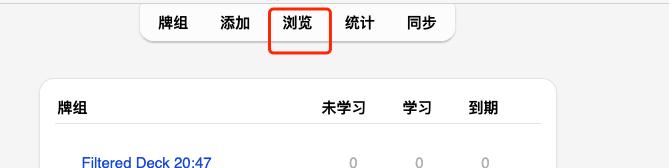
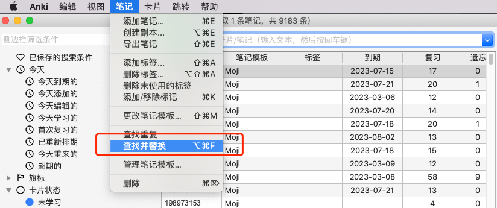
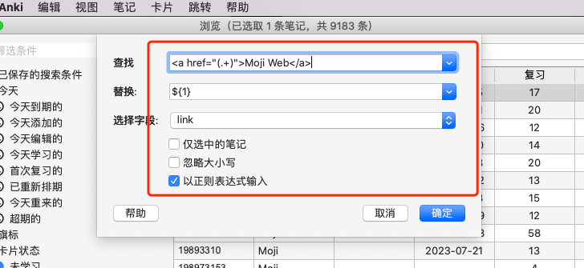

# 批量更新link字段的格式

v.2.0.0版本插件修改了link字段存储的格式，且使用hook机制兼容历史的数据，因此使用客户端复习时不会有问题。
但如果在anki web复习，则会出现无法通过链接跳转到moji web的问题。
如果需要使用anki web复习，可以按照下面的步骤更新历史数据。

1.点击浏览


2.选择查找并替换


3.输入相应的数据

查找：
```
<a href="(.+)">Moji Web</a>
```

替换：
```
${1}
````

选择字段：link

以正则表达式输入：是



4.点击确定