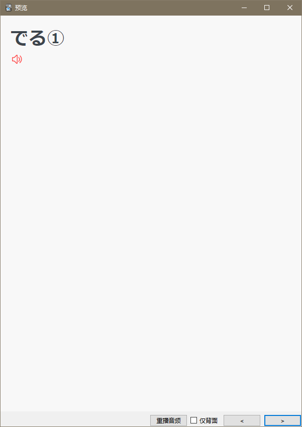
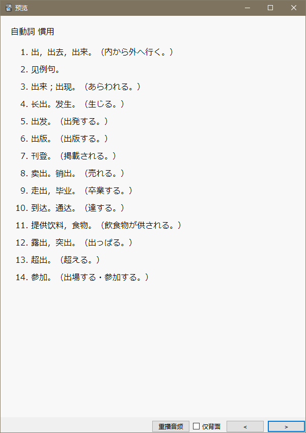
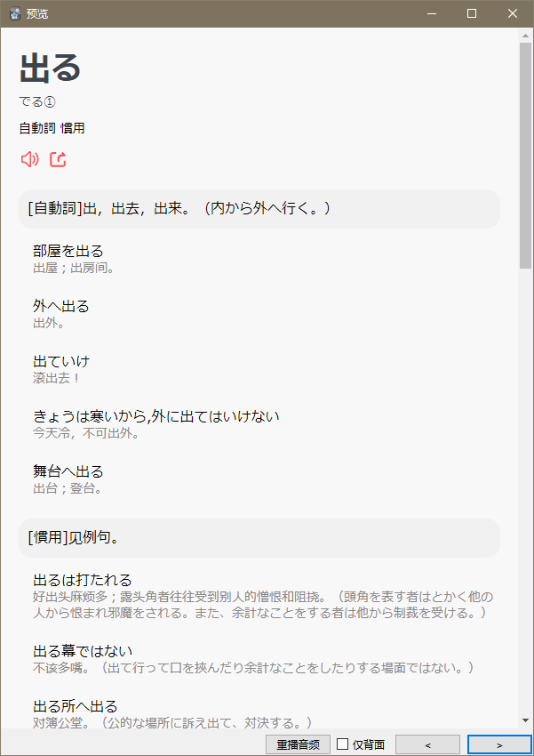
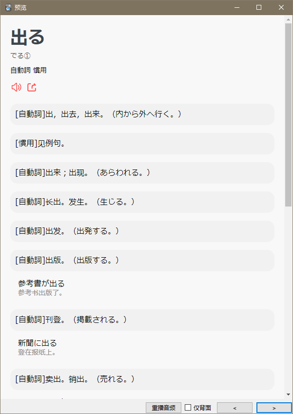

### 说明
基于 **MojiToAnki(导入mojidict.com收藏的单词)** 插件做了如下修改：
1. 增加了词单目录ID的配置，多次导入不用重新输入目录ID
2. 原本释义字段为预览释义，增加完整释义字段
3. 美化模板，增加了例句的展示
4. 增加了正面为①假名+读音 ②释义的模板

### 使用方法
1. 安装原插件（ID：131403862）
2. 打开“工具->插件”，选择“MojiToAnkimojidictcom”插件，点击“插件文件”，替换core文件夹中的如下四个文件：
   * gui.py
   * mojidict_server.py
   * styles.py
   * utils.py
3. 启动（重启）Anki，点击“工具->从Moji导入”
4. 剩下的看原插件链接说明

### 效果图片
正面1（假名+音调+读音）

正面2（单词）

正面3（词性+释义）

背面

背面点击释义可以折叠例句：

原插件链接：https://ankiweb.net/shared/info/131403862

原项目地址：https://github.com/qiyu/anki_moji